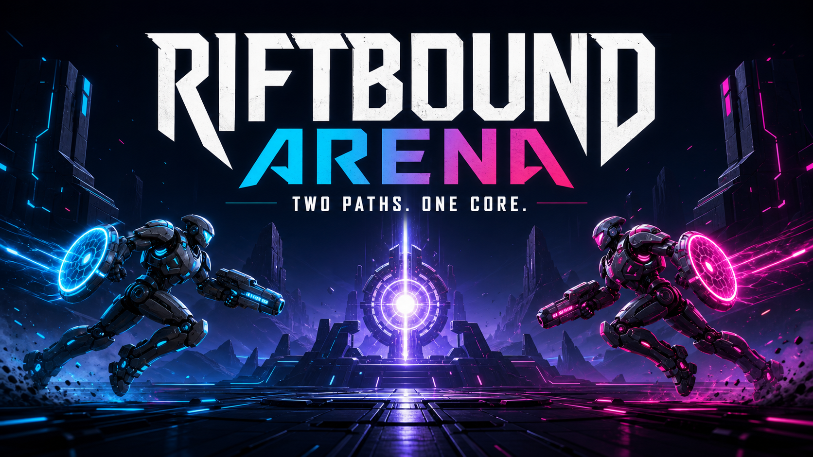

# Riftbound Arena

An online-first, best-of-three side-scrolling action duel. Two pilots enter a shared map from opposite ends, defeat increasingly dangerous minions, build a run-specific loadout, and converge on the relay core before the arena collapses inward.



## Play the vertical slice

Requirements: Node.js 22.13+ and npm.

```bash
npm install
npm run dev
```

Open the web URL printed by the dev server. The same command starts the match relay on port `8788`.

### Test online play on one PC

1. Choose **Create Online Room** in the first browser tab.
2. Open the game in a second tab.
3. Enter the five-character room code and choose **Join**.
4. Each tab launches into its own pilot-centered camera.

For another computer on the same network, open the first computer's LAN URL and use the same room-code flow. A hosted relay can be configured with `NEXT_PUBLIC_RELAY_URL` (see `.env.example`).

Choose **Learn to Play** for a five-step field brief and guided training run, or **Solo Practice** to jump straight into a match against the synth pilot.

## How to play

1. Push toward the center while defeating minions. Enemies become tougher near the core, but grant more EXP and better rewards.
2. Level up to increase blaster damage and maximum health. Collect weapon, shield, repair, cloak, and overdrive pickups to shape the current run.
3. Reach the center first to claim a repair, shield recharge, EXP burst, and temporary overdrive. After 45 seconds, the arena starts collapsing inward so neither player can farm forever.
4. Use your shield to absorb a dangerous burst and your dash to evade or close distance. Both have cooldowns, so timing matters.
5. Reduce the rival pilot to zero health to win the round. Win two rounds to take the match. If a minion or the collapsing arena defeats you, you reboot at your starting point and lose that run's EXP and upgrades.

## Controls

| Action | Key |
| --- | --- |
| Move | `A` / `D` |
| Jump | `W` |
| Fire | `F` |
| Shield | `G` |
| Dash | `H` |

## Current systems

- Online room creation and joining with separate per-player cameras
- Host-authoritative prototype simulation relayed to the second client at 20 Hz
- Five minion classes with difficulty and reward scaling toward center
- EXP levels that increase maximum health and blaster damage
- Weapon, shield, repair, cloak, and overdrive pickups
- First-contact relay reward: EXP burst, repair, shield recharge, and timed overdrive
- Arena collapse after 45 seconds to prevent indefinite farming
- Minion/storm defeat resets the run; rival defeat wins the round
- Best-of-three match flow and a solo combat bot

The relay is intentionally lightweight for the vertical slice. A production competitive release should move the complete simulation into an authoritative regional game server, add input prediction/reconciliation, persistence, authentication, matchmaking, and abuse protection.

## Blender characters

Editable sources, game-ready GLB exports, and 1024px transparent renders live in `public/assets/characters/`. The procedural Blender models use the social hero art as their design reference: layered ceramic armor, dark mechanical joints, luminous panel seams, circular shield emitters, and oversized arm blasters.

Regenerate both pilots with Blender 5.x:

```powershell
& "C:\Program Files\Blender Foundation\Blender 5.1\blender.exe" --background --python tools\blender\create_characters.py -- public\assets\characters
```

## Checks

```bash
npm run build
npx tsc --noEmit
npm test
```

The web client uses React, Phaser, vinext, and Cloudflare-compatible output. The room relay uses the `ws` WebSocket library.
